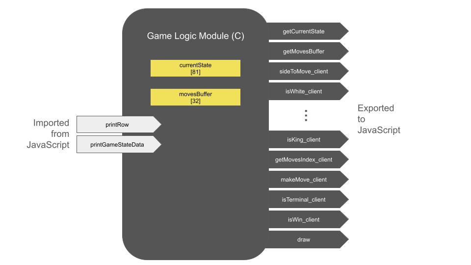
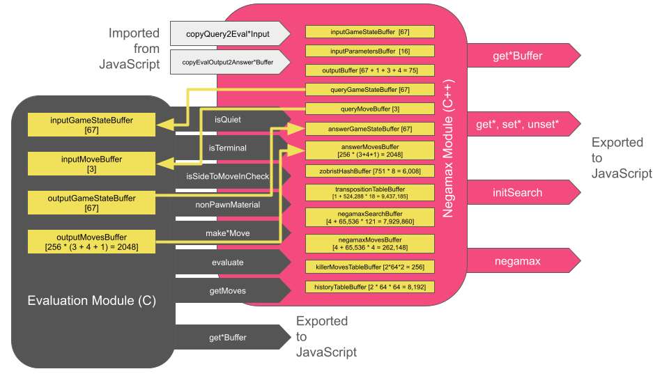

# [Chess](https://www.ericjoycefilm.com/wastesoftime/boardgames/chess/index.php?lang=en)
Notes on the creation of Chess

## Docker container to compile C to WebAssembly
Create the container.
```
sudo docker build -t emscripten-c .
```

Confirm its existence.
```
sudo docker images
```

Kill the container.
```
sudo docker image rm emscripten-c
```

## Zobrist hash generator
This executable lives on the back-end. Call it when the page loads to generate a Zobrist hash for every game.
```
gcc -Wall zgenerate.c -lm -o zgenerate
```

## Client-facing game logic module
Compile the front-end, client-facing game-logic module. This WebAssembly module answers queries from the client-side like getting data about which pieces can move where.


```
sudo docker run --rm -v $(pwd):/src -u $(id -u):$(id -g) --mount type=bind,source=$(pwd),target=/home/src emscripten-c emcc -Os -s STANDALONE_WASM -s EXPORTED_FUNCTIONS="['_getCurrentState','_getMovesBuffer','_sideToMove_client','_isWhite_client','_isBlack_client','_isEmpty_client','_isPawn_client','_isKnight_client','_isBishop_client','_isRook_client','_isQueen_client','_isKing_client','_getMovesIndex_client','_makeMove_client','_isTerminal_client','_isWin_client','_draw']" -Wl,--no-entry "gamelogic.c" -o "gamelogic.wasm"
```

## Negamax & evaluation engines
I have separated game logic and node evaluation from tree-search. This allows me to have a single negamax engine (in C++) for two-player, non-stochastic, perfect-information games (written in whatever language). The JavaScript class `player.js` glues together and coordinates these components.



For Chess:
| Name  | Bytes  | Description |
| :---:	| :----: | :---------: |
| _GAMESTATE_BYTE_SIZE | 81 | Number of bytes needed to encode a game state |
| _MOVE_BYTE_SIZE | 3 | Number of bytes needed to describe a move in Chess |
| _MAX_NUM_TARGETS | 32 | A (generous) upper bound on how many distinct destinations (not distinct moves) may be available to a player from a single index |
| _MAX_MOVES | 64 | A (generous) upper bound on how many moves may be made by a team in a single turn |
| _TREE_SEARCH_ARRAY_SIZE | 65536 | Number of (game-state bytes, move-bytes) |
| _NEGAMAX_NODE_BYTE_SIZE | 129 | Number of bytes needed to encode a negamax node |
| _TRANSPO_RECORD_BYTE_SIZE | 91 | Number of bytes needed to store a TranspoRecord object |
| _TRANSPO_TABLE_SIZE | 65536 | Number of TranspoRecords, each 91 bytes |
| ZHASH_TABLE_SIZE | 751 | Number of Zobrist keys |

Compile the evaluation engine:
```
sudo docker run --rm -v $(pwd):/src -u $(id -u):$(id -g) --mount type=bind,source=$(pwd),target=/home/src emscripten-c emcc -Os -s STANDALONE_WASM -s EXPORTED_FUNCTIONS="['_getInputBuffer','_getOutputBuffer','_isQuiet','_isTerminal','_evaluate','_getSortedMoves']" -Wl,--no-entry "philadelphia.c" -o "eval.wasm"
```

Compile the negamax engine:
```
sudo docker run --rm -v $(pwd):/src -u $(id -u):$(id -g) --mount type=bind,source=$(pwd),target=/home/src emscripten-c em++ -I ./ -Os -s STANDALONE_WASM -s INITIAL_MEMORY=16056320 -s STACK_SIZE=1048576 -s EXPORTED_FUNCTIONS="['_getInputBuffer','_getQueryBuffer','_getOutputBuffer','_getZobristHashBuffer','_getTranspositionTableBuffer','_getNegamaxSearchBuffer','_getAuxiliaryBuffer','_initSearch','_negamax']" -Wl,--no-entry "negamax.cpp" -o "negamax.wasm"
```

## Citation
If this code was helpful to you, please cite this repository.

```
@misc{chess,
  title={Chess in C},
  author={Eric C. Joyce},
  year={2025},
  publisher={Github},
  journal={GitHub repository},
  howpublished={\url{https://github.com/EricCJoyce/Chess}}
}
```
